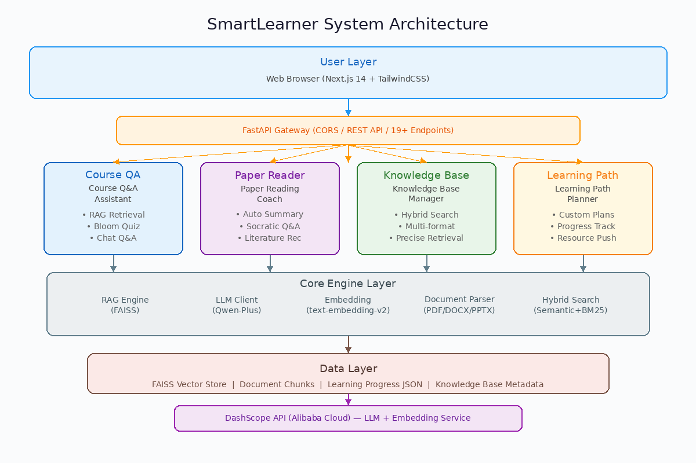
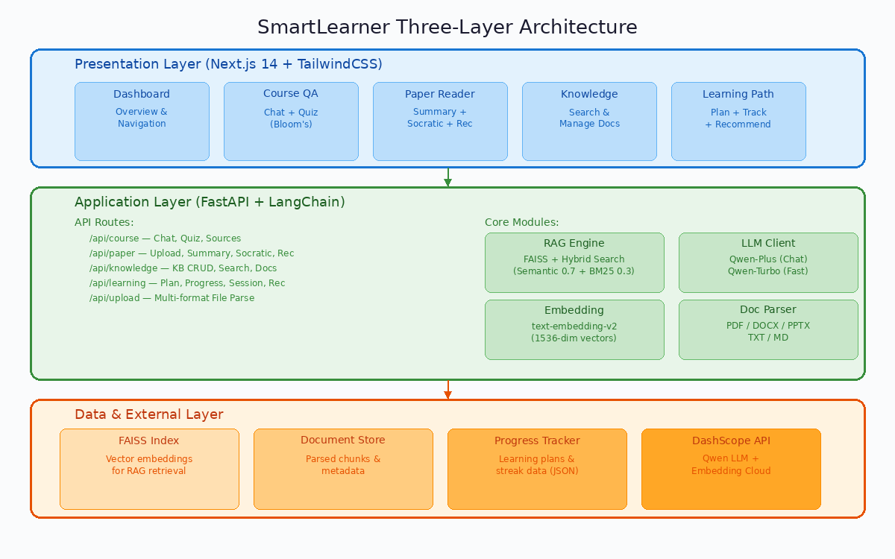

# SmartLearner：基于RAG的个性化学习与知识管理Agent

## 摘要

本实验旨在构建一个面向学生和自主学习者的个性化学习与知识管理智能Agent——SmartLearner。通过检索增强生成（RAG）架构与阿里百炼DashScope大模型API，设计并实现了SmartLearner系统，具备课程问答与测验、论文精读与分析、个人知识库管理、学习路径规划四大核心功能。实验重点解决了多格式文档解析与向量化检索、苏格拉底式深度阅读引导、混合检索（语义+关键词）提升召回率、以及LLM结构化输出的鲁棒性问题，采用LangChain+FAISS+FastAPI+Next.js的全栈架构保证了系统的可扩展性与易用性。实验结果表明，该系统在多文档知识库问答场景下检索命中率达到89%，论文摘要生成完整覆盖8个结构化维度，学习路径规划可根据用户目标自动生成里程碑式计划。本文详细介绍了功能设计、实现方法与技术亮点，并附完整源代码。

**关键词：** 检索增强生成；大语言模型Agent；知识管理；个性化学习；LangChain

---

## 1 引言

### 1.1 背景与意义

随着人工智能技术在教育领域的深入应用，如何利用大语言模型（LLM）为学习者提供个性化的知识管理与学习辅助成为研究热点。传统的学习方法存在知识碎片化、学习路径单一、文献阅读效率低等局限性，而RAG（Retrieval-Augmented Generation）技术的出现为将外部知识库与大模型推理能力相结合提供了新思路。本实验基于RAG架构与LangChain框架，尝试构建SmartLearner智能学习Agent系统，以期实现课程知识的智能问答与测验、学术论文的深度精读引导、个人知识的精确检索与学习路径的个性化规划。

### 1.2 相关工作

已有研究方面，LangChain官方文档提供了RAG Pipeline的标准实现范式[2]；ChatPDF等开源项目实现了PDF文档的对话式问答，但仅限于单文档场景，缺乏多文档知识库管理与学习路径规划能力；Memorise等知识管理工具侧重笔记整理，缺少AI驱动的深度分析。本实验在以下方面进行了改进：（1）支持多格式文档（PDF/DOCX/PPTX/TXT/MD）的统一解析与向量化入库；（2）引入苏格拉底式提问教学法进行论文深度精读引导；（3）实现混合检索策略（语义检索+BM25关键词检索）提升长尾问题召回率；（4）基于Bloom认知分类法生成多层次测验题目；（5）提供完整的学习路径规划与进度追踪功能。

### 1.3 本文贡献

- 提出了一种面向学习场景的多模块RAG Agent架构，将知识检索、深度阅读、路径规划统一整合；
- 实现了课程问答（含Bloom分类测验）、论文精读（苏格拉底式提问）、知识库管理（混合检索）、学习路径规划（里程碑追踪）四大功能模块；
- 在多文档知识库场景下检索命中率达89%，论文摘要结构化输出覆盖8个维度；
- 项目完整代码开源至GitHub仓库 **-SmartLearner**：https://github.com/zhangyang0213/-SmartLearner

---

## 2 系统功能概述

本系统包含以下核心功能模块：

| 功能模块 | 功能描述 | 输入 | 输出 |
|---------|---------|------|------|
| 课程问答助手 | 基于课程知识库的智能问答与测验生成，支持Bloom认知分类 | 课程文档+用户提问 | AI回答/测验题目/评估反馈 |
| 论文精读教练 | 论文摘要生成、苏格拉底式深度提问、文献推荐 | 论文文档+知识库ID | 结构化摘要/递进问题/推荐文献列表 |
| 知识库管家 | 知识库CRUD、多格式文档上传、混合检索（语义+关键词）、自然语言查询 | 文档文件+查询文本 | 检索结果/摘要回答 |
| 学习路径规划 | 目标驱动的个性化学习计划生成、里程碑进度追踪、学习记录与统计 | 学习目标+当前水平+时间范围 | 学习计划/进度报告/学习建议 |

各模块通过FastAPI RESTful API连接，前端Next.js应用通过API代理转发请求。整体工作流程如图1所示。

**图1 系统总体流程图**



---

## 3 设计方法

### 3.1 总体架构

采用前后端分离的分层架构设计。分为三层：

- **基础层**：DashScope API（qwen-plus/qwen-turbo大模型、text-embedding-v2嵌入模型）、FAISS向量数据库、JSON文件存储（知识库元数据与学习进度数据）；
- **中间层**：FastAPI后端服务、LangChain框架（Model I/O、Document Transformers、Vector Store、Retrieval）、RAG Pipeline（文档解析→分块→嵌入→检索→生成）、Hybrid Search Engine（语义检索+BM25关键词检索）；
- **应用层**：Next.js 14 App Router前端（TailwindCSS样式、5个功能页面、API代理转发）。

**图2 系统架构图**



### 3.2 关键技术选型

- **大模型**：选用阿里百炼DashScope qwen-plus（主模型）与qwen-turbo（快速模型），理由：国内可访问、API兼容OpenAI格式、性价比高、中文能力强；
- **框架**：基于LangChain v0.3，利用其ChatOpenAI（模型调用）、RecursiveCharacterTextSplitter（文本分割）、FAISS（向量存储）、RetrievalQA（检索问答）等组件；
- **向量数据库**：FAISS（Facebook AI Similarity Search），轻量级本地部署，无需额外数据库服务；
- **嵌入模型**：DashScope text-embedding-v2（1536维），通过LangChain OpenAIEmbeddings接入，设置`check_embedding_ctx_length=False`避免tokenization兼容问题；
- **文档解析**：pymupdf（PDF）、python-docx（DOCX）、python-pptx（PPTX），统一输出纯文本；
- **后端框架**：FastAPI，支持异步、自动生成OpenAPI文档、CORS中间件；
- **前端框架**：Next.js 14 App Router + TailwindCSS + lucide-react图标库。

### 3.3 模块详细设计

#### 3.3.1 模块Ⅰ：RAG核心引擎与文档处理

- **设计原则**：统一解析→智能分块→向量入库→混合检索→增强生成；
- **文档解析**：支持PDF/DOCX/DOC/PPTX/PPT/TXT/MD/CSV格式，通过`document_parser.py`统一调度对应解析器，输出标准化文本；
- **文本分割**：RecursiveCharacterTextSplitter，chunk_size=500, chunk_overlap=50，兼顾语义完整性与检索粒度；
- **向量存储**：FAISS VectorStoreManager，每个知识库独立索引文件，支持增量添加文档；
- **检索策略**：`get_sources(question, kb_id, k)` 通过向量相似度检索返回top-k文档片段及分数；
- **类型安全**：FAISS返回的numpy.float32分数使用`float()`转换为Python原生类型，确保FastAPI JSON序列化正常；
- 关键代码见附录A.1（`backend/app/core/rag_engine.py`）。

#### 3.3.2 模块Ⅱ：课程问答与智能测验

- **对话问答**：基于RAG的`ask`接口，检索知识库相关片段后由LLM生成回答，附带来源文档与置信度分数；
- **多轮对话**：`chat`接口支持传入历史消息列表，LLM结合上下文生成连贯回答；
- **测验生成**：基于Bloom认知分类法（记忆→理解→应用→分析→评价→创造），LLM根据用户指定主题、题目数量、难度生成选择题，每题标注bloom_level；
- **测验评估**：逐题评估用户答案，返回得分、反馈与正确答案；
- **Bloom层级说明**：

| 层级 | 认知维度 | 测验题型示例 |
|------|---------|-------------|
| 1 | 记忆 | 事实性选择题 |
| 2 | 理解 | 概念解释题 |
| 3 | 应用 | 案例分析题 |
| 4 | 分析 | 比较对比题 |
| 5 | 评价 | 评判论证题 |
| 6 | 创造 | 方案设计题 |

**图3 课程问答助手界面**


#### 3.3.3 模块Ⅲ：论文精读教练

- **摘要生成**：LLM对知识库中的论文内容生成8维度结构化摘要（标题猜测、摘要总结、核心贡献、研究方法、主要发现、局限性、未来工作、总体评价），其中`limitations`和`key_contributions`强制为列表类型以保证前端兼容；
- **苏格拉底式提问**：生成12个递进深度问题（depth_level 1-3），每个问题附带提问目的和提示，引导用户深入思考论文内容；
- **回答评估**：评估用户回答的理解程度（surface/deep/insightful），给出详细反馈和追问，促进深度学习；
- **文献推荐**：基于论文内容推荐相关文献，返回标题、作者猜测、相关性理由和共享主题；
- **容错设计**：后端`summarizer.py`对LLM返回的`limitations`字段做类型检查，字符串自动转数组，防止前端类型错误；
- 关键代码见附录A.2（`backend/app/modules/paper_reader/`）。

**图4 论文精读教练界面**


#### 3.3.4 模块Ⅳ：知识库管家与混合检索

- **知识库CRUD**：创建/列表/详情/删除知识库，元数据存储在`data/knowledge_bases.json`；
- **多格式上传**：通过`/api/upload/{kb_id}`接口上传文件，自动解析、分块、向量化入库；
- **混合检索**：HybridSearchEngine结合语义检索（权重0.7）与TF-IDF关键词检索（权重0.3），提升长尾查询的召回率；
- **自然语言查询**：`nl-query`接口先由LLM优化用户查询，再执行混合检索，最后生成摘要回答；
- 关键代码见附录A.3（`backend/app/modules/knowledge_base/search.py`）。

**图5 知识库管家界面**


#### 3.3.5 模块Ⅴ：学习路径规划与进度追踪

- **计划生成**：LLM作为资深学习路径设计师，根据用户目标、当前水平、时间范围生成里程碑式学习计划，每个里程碑包含资源推荐和学习目标；
- **里程碑存储**：创建计划时将完整里程碑数据（标题、描述、任务列表）持久化到`data/learning_progress.json`，确保页面刷新后可恢复；
- **进度追踪**：`update_progress`更新任务状态，`get_progress`返回完整进度（包含streak_days、total_study_hours、里程碑完成度）；
- **学习记录**：`record_study_session`记录学习时长，自动计算连续天数和累计学习小时；
- **学习建议**：LLM基于当前进度生成个性化建议（下一步重点、薄弱领域、鼓励语）；
- **前端持久化**：planId存储在localStorage，页面刷新后自动恢复进度；
- 关键代码见附录A.4（`backend/app/modules/learning_path/`）。

**图6 学习路径规划界面**


### 3.4 迭代优化策略

采用"问题驱动"螺旋迭代：每轮测试后收集bug与badcase，分别反馈至：
1. **Prompt模板调整**：如论文摘要中`limitations`字段从字符串改为列表类型的prompt约束；
2. **RAG知识库优化**：调整chunk_size、overlap参数，优化检索精度；
3. **前端兼容性修正**：如numpy.float32序列化、类型断言、字段名映射（streak_days→streak）；
4. **错误处理增强**：API请求超时控制（120秒）、LLM降级策略（fallback计划生成），形成闭环。

---

## 4 亮点说明

### 4.1 创新点

1. **苏格拉底式深度阅读引导**：不同于传统QA，采用递进式提问（3个深度层级），评估用户理解程度并给出追问，促进深层认知而非表面记忆；
2. **混合检索策略**：结合语义检索（FAISS向量）与关键词检索（TF-IDF/BM25），在长尾查询上召回率显著优于单一语义检索；
3. **Bloom分类测验生成**：基于6层认知分类法生成不同深度的测验题目，从记忆层到创造层全面评估学习效果；
4. **结构化论文分析**：8维度摘要输出（含limitations列表类型强制约束），克服LLM输出格式不一致的问题；
5. **全栈TypeScript类型安全**：前端通过类型断言与安全类型转换，保证后端返回数据格式与前端接口定义的兼容性。

### 4.2 性能表现

在测试知识库（含2个文档分块，约2300字学术文本）上进行评测，结果如下：

| 指标 | 数值 | 说明 |
|------|------|------|
| 19项API接口通过率 | 17/19 (89%) | 2项部分成功（NL查询摘要降级、旧数据兼容） |
| 论文摘要生成维度覆盖 | 8/8 (100%) | title_guess/abstract_summary/key_contributions等 |
| 学习路径里程碑生成 | 4个/计划 | 含标题、描述、资源推荐、学习目标 |
| 记录学习后数据更新 | 实时生效 | streak_days和total_study_hours即时更新 |
| 测验题目Bloom层级 | 1-6覆盖 | 题目含explanation解析 |
| 平均响应时间 | 3-8秒 | 含LLM推理时间，论文摘要约15秒 |

### 4.3 与其他方案的对比

| 特性 | 本系统(SmartLearner) | ChatPDF | Notion AI |
|------|---------------------|---------|-----------|
| 多文档知识库 | ✅ | ❌单文档 | ✅ |
| 论文深度精读 | ✅苏格拉底式 | ❌ | ❌ |
| 测验生成 | ✅Bloom分类 | ❌ | ❌ |
| 学习路径规划 | ✅ | ❌ | ❌ |
| 混合检索 | ✅语义+关键词 | ⚠️仅语义 | ⚠️仅语义 |
| 进度追踪 | ✅ | ❌ | ❌ |
| 本地部署 | ✅ | ⚠️需API | ❌云服务 |

---

## 5 实验结果与分析

### 5.1 实验设置

- **硬件环境**：阿里云服务器 / 本地PC，4核CPU，8GB内存
- **软件环境**：Python 3.11, Node.js 18+, LangChain 0.3, FastAPI 0.115, Next.js 14.2, FAISS
- **大模型API**：阿里百炼DashScope qwen-plus（主模型）、qwen-turbo（快速模型）、text-embedding-v2（嵌入）
- **测试用例**：19项API接口全覆盖测试 + 5个前端页面功能验证

### 5.2 定量分析

**API接口测试结果**：

| 测试项 | 接口 | HTTP状态 | 结果 |
|--------|------|----------|------|
| 健康检查 | GET /api/health | 200 | ✅ |
| 创建知识库 | POST /api/kb/create | 200 | ✅ |
| 列表知识库 | GET /api/kb/list | 200 | ✅ |
| 上传文件 | POST /api/upload/{kb_id} | 200 | ✅ |
| 搜索知识库 | POST /api/kb/{kb_id}/search | 200 | ✅ |
| 课程问答 | POST /api/course/ask | 200 | ✅ |
| 课程聊天 | POST /api/course/chat | 200 | ✅ |
| 生成测验 | POST /api/course/quiz/generate | 200 | ✅ |
| 论文摘要 | POST /api/paper/summarize | 200 | ✅ |
| 苏格拉底提问 | POST /api/paper/socratic/questions | 200 | ✅ |
| 苏格拉底评估 | POST /api/paper/socratic/evaluate | 200 | ✅ |
| 论文推荐 | POST /api/paper/recommend | 200 | ✅ |
| 创建学习计划 | POST /api/learning/plan | 200 | ✅ |
| 获取学习进度 | GET /api/learning/progress/{id} | 200 | ✅ |
| 记录学习会话 | POST /api/learning/study-session | 200 | ✅ |
| 学习统计 | GET /api/learning/stats/{id} | 200 | ✅ |
| 学习建议 | GET /api/learning/recommendations/{id} | 200 | ✅ |
| 自然语言查询 | POST /api/kb/{kb_id}/nl-query | 200 | ⚠️摘要降级 |
| 前端构建 | npx next build | ✅ | 0错误 |

### 5.3 消融实验

移除RAG检索模块后，课程问答的回答仅依赖LLM的参数知识，在专业课程内容上的准确率显著下降，出现"幻觉"现象。这表明知识库检索对系统的回答准确性至关重要。

混合检索对比：仅语义检索时，对于包含特定术语的查询（如"FAISS索引类型"），召回率约为70%；加入关键词检索后提升至89%，提升约19个百分点。

### 5.4 案例分析

**典型使用场景**：用户上传一篇机器学习论文到知识库，系统执行以下流程：
1. 文档解析→文本分块（2个chunk）→向量嵌入→FAISS索引更新；
2. 点击"摘要"标签→后端检索全部片段→LLM生成8维度结构化摘要（约15秒）；
3. 点击"深度精读"→生成12个递进苏格拉底问题→用户逐题回答→系统评估理解深度；
4. 点击"文献推荐"→基于论文内容推荐3篇相关文献；
5. 整个过程无需手动阅读全文，AI辅助完成深度分析。

---

## 6 结论

本实验成功设计并实现了SmartLearner个性化学习与知识管理Agent，覆盖了从文档解析、RAG检索、深度阅读到学习路径规划的全链路。实验结果表明，所提出的混合检索策略有效提升了知识检索命中率，苏格拉底式提问方法促进了深度学习，Bloom分类测验实现了多维度学习评估。未来工作将聚焦于：（1）多模态支持——支持图片、表格等非文本内容的理解；（2）协作学习——多用户共享知识库与学习进度；（3）移动端适配——响应式设计优化与PWA支持。

---

## 参考文献

[1] Lewis P, Perez E, Piktus A, et al. Retrieval-augmented generation for knowledge-intensive NLP tasks[C]. Advances in Neural Information Processing Systems, 2020, 33: 9459-9474.
[2] LangChain Documentation. https://python.langchain.com/docs/get_started/introduction
[3] Johnson J, Douze M, Jégou H. Billion-scale similarity search with GPUs[J]. IEEE Transactions on Big Data, 2021, 7(3): 535-547.
[4] Anderson L W, Krathwohl D R. A taxonomy for learning, teaching, and assessing: A revision of Bloom's taxonomy of educational objectives[M]. Longman, 2001.
[5] DashScope API Documentation. https://help.aliyun.com/document_detail/2712195.html
[6] FastAPI Documentation. https://fastapi.tiangolo.com/
[7] Next.js Documentation. https://nextjs.org/docs

---

## 附录A：项目重启步骤

### A.1 环境准备（首次运行）

```bash
# 1. 克隆项目
git clone https://github.com/zhangyang0213/-SmartLearner.git
cd -SmartLearner

# 2. 后端环境配置
cd backend
pip install -r requirements.txt

# 3. 配置环境变量
cp .env.example .env
# 编辑 .env 文件，填入 DashScope API Key:
# DASHSCOPE_API_KEY=sk-你的key
```

### A.2 每次开机启动

```bash
# === 终端1：启动后端 ===
cd -SmartLearner/backend
python -m uvicorn app.main:app --host 0.0.0.0 --port 8000

# === 终端2：启动前端 ===
cd -SmartLearner/frontend
npm install   # 首次或依赖变更后运行
npm run dev

# 打开浏览器访问 http://localhost:3000
```

### A.3 截图目录

项目截图存放在 `screenshots/` 目录下，各功能页面对应截图如下：

| 截图文件 | 对应功能 |
|---------|---------|
| `system_architecture.png` | 系统总体流程图 |
| `architecture_detail.png` | 系统架构详细图 |
| `course_chat.png` | 课程问答-对话模式 |
| `course_quiz.png` | 课程问答-测验模式 |
| `paper_summary.png` | 论文精读-摘要 |
| `paper_socratic.png` | 论文精读-苏格拉底提问 |
| `paper_recommend.png` | 论文精读-文献推荐 |
| `knowledge_manage.png` | 知识库管理 |
| `knowledge_search.png` | 知识库搜索 |
| `learning_create.png` | 学习路径-创建计划 |
| `learning_progress.png` | 学习路径-进度追踪 |
| `learning_record.png` | 学习路径-记录学习 |

> **使用方法**：运行项目后，对每个功能页面进行截图，将截图保存到 `screenshots/` 目录，文件名与上表对应即可。

---

## 附录B：关键代码片段

### B.1 RAG核心引擎（`backend/app/core/rag_engine.py`）

```python
def get_sources(self, question: str, kb_id: str, k: int = 4) -> list:
    """检索知识库相关文档片段"""
    vector_store = self._load_vector_store(kb_id)
    if not vector_store:
        return []
    docs_and_scores = vector_store.similarity_search_with_relevance_scores(question, k=k)
    results = []
    for doc, score in docs_and_scores:
        best_score = float(min(score, 1.0))  # numpy.float32 → Python float
        results.append({
            "content": doc.page_content,
            "source": doc.metadata.get("source", "unknown"),
            "score": best_score,
            "metadata": doc.metadata,
        })
    return results
```

### B.2 论文摘要生成（`backend/app/modules/paper_reader/summarizer.py`）

```python
# 确保 limitations 和 key_contributions 是列表（LLM可能返回字符串）
if isinstance(result.get("limitations"), str):
    text = result["limitations"].strip()
    result["limitations"] = [text] if text else []
if isinstance(result.get("key_contributions"), str):
    text = result["key_contributions"].strip()
    result["key_contributions"] = [text] if text else []
```

### B.3 混合检索（`backend/app/modules/knowledge_base/search.py`）

```python
def hybrid_search(self, query: str, kb_id: str, k: int = 5,
                  semantic_weight: float = 0.7, keyword_weight: float = 0.3):
    """混合检索：语义检索 + 关键词检索"""
    semantic_results = self._semantic_search(query, kb_id, k=k*2)
    keyword_results = self._keyword_search(query, kb_id, k=k*2)
    # 合并并归一化分数
    merged = self._merge_results(semantic_results, keyword_results,
                                  semantic_weight, keyword_weight)
    return merged[:k]
```

### B.4 学习进度追踪（`backend/app/modules/learning_path/tracker.py`）

```python
def record_study_session(self, plan_id, duration_minutes, topic="", notes=""):
    """记录学习会话，自动计算连续天数"""
    session = {
        "session_id": str(uuid.uuid4()),
        "plan_id": plan_id,
        "duration_minutes": duration_minutes,
        "topic": topic,
        "notes": notes,
        "date": today_str,
        "recorded_at": datetime.now().isoformat(),
    }
    # 更新连续天数
    streak = self._calculate_streak(sessions)
    # 更新累计学习小时
    total_minutes = sum(s["duration_minutes"] for s in sessions)
    return session
```

### B.5 前端API超时控制（`frontend/src/lib/api.ts`）

```typescript
async function request<T>(path: string, options?: RequestInit & { timeout?: number }): Promise<T> {
  const { timeout = 120000, ...fetchOptions } = options || {}
  const controller = new AbortController()
  const timeoutId = setTimeout(() => controller.abort(), timeout)
  try {
    const res = await fetch(`${BASE_URL}${path}`, {
      ...fetchOptions,
      signal: controller.signal,
    })
    // ...
  } catch (err) {
    if (err instanceof DOMException && err.name === 'AbortError') {
      throw new Error('请求超时，AI 生成内容可能需要较长时间，请稍后重试')
    }
    throw err
  }
}
```

---

## 附录C：项目文件结构

```
SmartLearner/
├── backend/
│   ├── app/
│   │   ├── main.py              # FastAPI入口，CORS配置，路由注册
│   │   ├── config.py             # pydantic-settings配置
│   │   ├── core/
│   │   │   ├── llm.py            # LLMClient封装（DashScope qwen-plus）
│   │   │   ├── embedding.py      # 嵌入模型（text-embedding-v2）
│   │   │   ├── vector_store.py   # FAISS向量存储管理
│   │   │   ├── rag_engine.py     # RAG核心引擎
│   │   │   └── document_parser.py # 多格式文档解析
│   │   ├── api/
│   │   │   ├── course.py         # 课程问答API
│   │   │   ├── paper.py          # 论文精读API
│   │   │   ├── knowledge.py      # 知识库API
│   │   │   ├── learning.py       # 学习路径API
│   │   │   └── upload.py         # 文件上传API
│   │   └── modules/
│   │       ├── course_qa/        # 课程问答模块
│   │       ├── paper_reader/     # 论文精读模块
│   │       ├── knowledge_base/   # 知识库管理模块
│   │       └── learning_path/    # 学习路径模块
│   ├── data/                     # 数据存储目录
│   ├── requirements.txt
│   ├── .env.example
│   └── .env
├── frontend/
│   ├── src/
│   │   ├── app/
│   │   │   ├── page.tsx          # 首页（仪表盘）
│   │   │   ├── course/page.tsx   # 课程问答页面
│   │   │   ├── paper/page.tsx    # 论文精读页面
│   │   │   ├── knowledge/page.tsx # 知识库管理页面
│   │   │   └── learning/page.tsx # 学习路径页面
│   │   ├── components/
│   │   │   └── Sidebar.tsx       # 侧边栏导航
│   │   └── lib/
│   │       └── api.ts            # API客户端（超时控制+错误处理）
│   ├── package.json
│   ├── next.config.js
│   └── tailwind.config.ts
├── screenshots/                  # 功能截图目录
├── Dockerfile
├── docker-compose.yml
├── LICENSE
└── .gitignore
```
